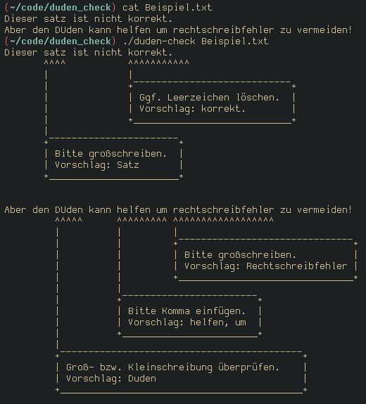

# duden_check

Dieses Programm nutzt die API von [DUDEN Mentor](https://mentor.duden.de/), um Texte auf Rechtschreibung, Grammatik, Zeichensetzung und Stil zu prüfen.
Da die gratis Version der API nur 250 Zeichen auf einmal unterstützt, wird jede Zeile der Eingabe einzeln überprüft.
Daher sollte jede Zeile einen oder mehrere *vollständige* Sätze abbilden, um Fehler durch mangelnden Kontext zu vermeiden.

## Lizenz

Dieses Programm ist lizenziert unter der [MIT](https://github.com/JxBP/blob/master/LICENSE) Lizenz.
